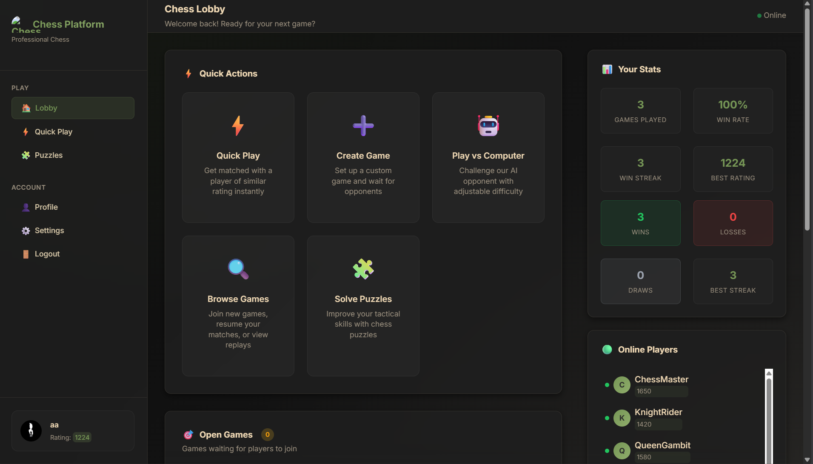
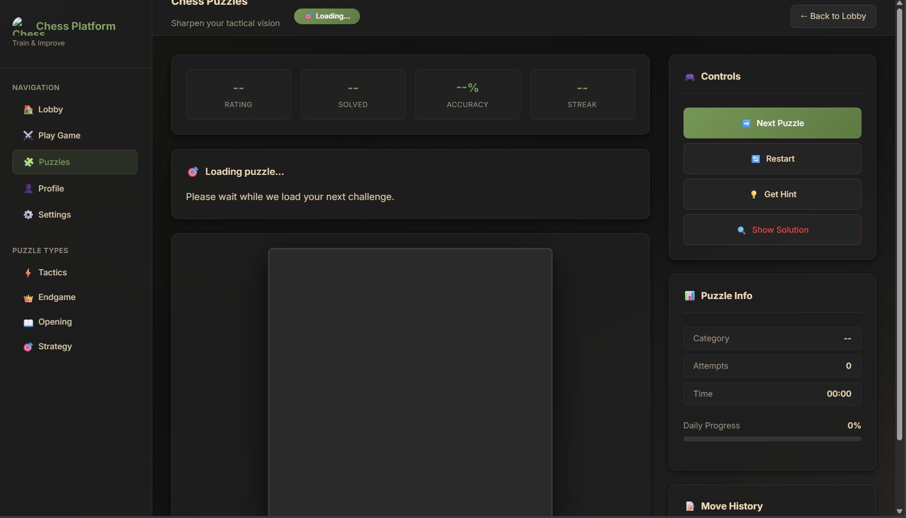

# ♟️ Chess Platform

A full-stack multiplayer chess platform with real-time gameplay, puzzles, ratings, and more.


---

## 📸 Screenshots

| Dashboard | Game Board | Puzzles |
|:---------:|:----------:|:-------:|
|  |  |  |

| Profile | Mobile App |
|:-------:|:----------:|
|  |  |

---

## ✨ Features

- **Real-time Multiplayer** — Play live games with WebSocket synchronization
- **Multiple Time Controls** — Bullet, Blitz, Rapid, and Classical formats
- **ELO Rating System** — Separate ratings for each time control
- **Chess Puzzles** — Improve tactics with puzzle training
- **User Profiles** — Track stats, win streaks, and achievements
- **Custom Chess Engine** — AI opponent with adjustable difficulty
- **Opening Database** — 20+ opening variations
- **Mobile App** — Native Android client (Kotlin/Jetpack Compose)

---

## 🛠️ Tech Stack

| Layer | Technology |
|-------|------------|
| **Backend** | Django 5.1, Django REST Framework, Channels (WebSocket) |
| **Frontend** | Vanilla JavaScript (ES6+), Custom CSS |
| **Database** | PostgreSQL / SQLite |
| **Mobile** | Kotlin, Jetpack Compose, Material3 |
| **Auth** | JWT (Simple JWT) |
| **Chess Logic** | python-chess |

---

## 🚀 Getting Started

### Prerequisites

- Python 3.10+
- Node.js (optional, for development tools)
- Redis (for WebSocket support)

### Installation

```bash
# Clone the repository
git clone https://github.com/yourusername/chess-platform.git
cd chess-platform

# Create virtual environment
python -m venv .venv
.venv\Scripts\activate      # Windows
source .venv/bin/activate   # macOS/Linux

# Install dependencies
pip install -r [requirements.txt](http://_vscodecontentref_/0)

# Run migrations
python [manage.py](http://_vscodecontentref_/1) migrate

# Create admin user
python [manage.py](http://_vscodecontentref_/2) createsuperuser

# Start the server
python [manage.py](http://_vscodecontentref_/3) runserver


